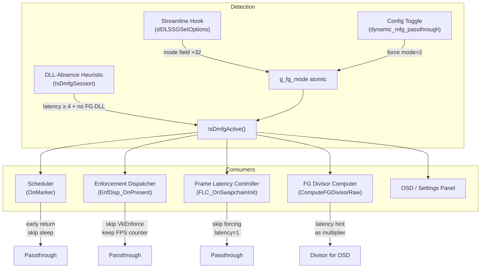

# Design Document: DMFG Passthrough

## Overview

This design ports Dynamic Multi-Frame Generation (DMFG) passthrough from the old "New Ultra Limiter" project into ReLimiter. DMFG is DLSS 4.5's `eAuto` mode where the NVIDIA driver dynamically adjusts the FG multiplier (3×–6×) at runtime on RTX 50-series (Blackwell+) GPUs. Unlike standard DLSS FG where a user-space DLL handles generation at a fixed multiplier, DMFG is entirely driver-side — no FG DLL is loaded. When DMFG is active, external frame limiters interfere with the driver's cadence control and must enter passthrough mode.

The design is purely additive: every code path gates on `IsDmfgActive()` returning true, and the default is false. When DMFG is not active, all existing behavior is byte-identical to the current implementation.

### Key Design Decisions

1. **Single query function (`IsDmfgActive()`)**: All subsystems use one authoritative check rather than reading `g_fg_mode` directly. This centralizes the OR-logic of Streamline detection and DLL-absence heuristic.

2. **New global `g_fg_mode`**: Added to `streamline_hooks.h/.cpp` alongside existing `g_fg_multiplier`, `g_fg_active`, `g_fg_presenting`. This mirrors the old Ultra Limiter's `ul_fg.hpp` pattern.

3. **Game-requested latency capture via atomic**: The Frame_Latency_Controller already calls `SetMaximumFrameLatency(1)` on swapchain init. We add a vtable hook on `IDXGISwapChain2::SetMaximumFrameLatency` to capture the game's requested value before overriding it, stored in a new atomic `g_game_requested_latency`. This is the same approach used in the old Ultra Limiter's `ul_reflex.cpp`.

4. **Early-return pattern for passthrough**: Rather than wrapping the entire scheduler in an if/else, we insert an early return after health/tier/inference checks. This minimizes diff size and keeps the hot path untouched.

5. **Config toggle is opt-in override**: `dynamic_mfg_passthrough` defaults to false. When enabled, it forces `g_fg_mode = 2` regardless of Streamline detection. Auto-detection via Streamline mode field or DLL-absence heuristic works independently.

## Architecture



### Data Flow

1. **Detection layer** writes `g_fg_mode` (from Streamline hook or config toggle).
2. **`IsDmfgActive()`** reads `g_fg_mode` and `IsDmfgSession()` — pure reads, no locks.
3. **Consumer subsystems** call `IsDmfgActive()` at their entry points and early-return or skip specific operations.
4. **Telemetry** (CSV, OSD) continues running regardless — the passthrough only skips pacing enforcement.

## Components and Interfaces

### New Globals (streamline_hooks.h)

```cpp
// DLSSGMode: 0=eOff, 1=eOn (static FG), 2=eAuto (Dynamic MFG)
extern std::atomic<int> g_fg_mode;

// Game's requested MaxFrameLatency, captured by FLC vtable hook
extern std::atomic<uint32_t> g_game_requested_latency;
```

### New Functions (streamline_hooks.h)

```cpp
// Returns true if no FG DLL is loaded AND game requested latency ≥ 4.
// Indicates driver-side DMFG without Streamline signaling.
bool IsDmfgSession();

// Returns true if g_fg_mode == 2 OR IsDmfgSession() returns true.
// Single authoritative DMFG check for all subsystems.
bool IsDmfgActive();

// Returns true if any of the 4 known FG DLLs are loaded.
bool IsFGDllLoaded();
```

### Modified Functions

| File | Function | Change |
|------|----------|--------|
| `streamline_hooks.cpp` | `Detour_SetOptions` | Read `mode` at offset +32 into `g_fg_mode`, gated by `dynamic_mfg_passthrough` |
| `scheduler.cpp` | `OnMarker` | Early return after health/tier/inference when `IsDmfgActive()`, with predictor stamp |
| `enforcement_dispatcher.cpp` | `EnfDisp_OnPresent` | Skip enforcement dispatch when `IsDmfgActive()`, keep FPS window update |
| `frame_latency_controller.cpp` | `FLC_OnSwapchainInit` | Skip `SetMaximumFrameLatency(1)` when `IsDmfgActive()` |
| `fg_divisor.cpp` | `ComputeFGDivisorRaw` | Incorporate latency hint when no FG DLL loaded and latency ≥ 3 |
| `config.h` | `Config` struct | Add `bool dynamic_mfg_passthrough = false` |
| `config.cpp` | `LoadConfig` / `SaveConfig` | Read/write `dynamic_mfg_passthrough` |
| `osd.cpp` | `DrawSettings` | Add DMFG checkbox in Advanced section |
| `osd.cpp` | `DrawOSD` | Show "FG: Dynamic" when DMFG active |

### New Config Field

```cpp
// In Config struct (config.h):
bool dynamic_mfg_passthrough = false;
```

INI key: `dynamic_mfg_passthrough` in `[FrameLimiter]` section.

### Game-Requested Latency Capture

The current `frame_latency_controller.cpp` calls `SetMaximumFrameLatency(1)` directly on the swapchain. To capture the game's requested value, we add a vtable hook on `IDXGISwapChain2::SetMaximumFrameLatency` (vtable index 31) that:

1. Stores the game's requested value in `g_game_requested_latency` (relaxed atomic).
2. If `IsDmfgActive()`, passes through the game's value unchanged.
3. Otherwise, overrides to 1 as before.

This hook is installed once during `FLC_OnSwapchainInit` for DX12 waitable swapchains. For DX11, the equivalent hook is on `IDXGIDevice1::SetMaximumFrameLatency`.

## Data Models

### State Atoms

| Name | Type | Default | Written By | Read By |
|------|------|---------|------------|---------|
| `g_fg_mode` | `std::atomic<int>` | 0 | `Detour_SetOptions`, `ApplyConfig`, `DrawSettings` | `IsDmfgActive()`, `DrawOSD` |
| `g_game_requested_latency` | `std::atomic<uint32_t>` | 0 | FLC vtable hook | `IsDmfgSession()`, `ComputeFGDivisorRaw()`, `DrawSettings` |
| `g_config.dynamic_mfg_passthrough` | `bool` | false | `LoadConfig`, `DrawSettings` | `Detour_SetOptions`, `ApplyConfig`, `IsDmfgActive()` |

### IsDmfgActive() Logic

```
IsDmfgActive() =
    g_fg_mode.load(relaxed) == 2
    OR IsDmfgSession()

IsDmfgSession() =
    g_game_requested_latency.load(relaxed) >= 4
    AND NOT IsFGDllLoaded()

IsFGDllLoaded() =
    GetModuleHandleW(L"nvngx_dlssg.dll") != NULL
    OR GetModuleHandleW(L"_nvngx_dlssg.dll") != NULL
    OR GetModuleHandleW(L"sl.dlss_g.dll") != NULL
    OR GetModuleHandleW(L"dlss-g.dll") != NULL
```

### FG Divisor with Latency Hint

```
ComputeFGDivisorRaw():
    // Existing path
    base = (fg_presenting && fg_multiplier > 0) ? fg_multiplier + 1 : 1

    // DMFG latency hint (new)
    if NOT IsFGDllLoaded() AND g_game_requested_latency >= 3:
        hint = min(g_game_requested_latency, 6)
        return max(base, hint)

    return base
```

### Scheduler Passthrough Insertion Point

```
OnMarker(frameID, now):
    RecordEnforcementMarker()
    TickHealthFrame()
    UpdateTier()
    CheckDeferredFGInference()    // must run before passthrough check

    // ── DMFG passthrough (new) ──
    if IsDmfgActive():
        log first occurrence
        g_predictor.OnEnforcement(frameID, now)
        return

    // ... existing Tier4, background, VRR/Fixed logic unchanged ...
```

### Enforcement Dispatcher Passthrough

```
EnfDisp_OnPresent(now_qpc):
    // ── Output FPS window (always runs) ──
    update rolling window...

    // ── DMFG passthrough (new) ──
    if IsDmfgActive():
        return    // skip enforcement, FPS already updated

    // ... existing path selection and dispatch ...
```


## Correctness Properties

*A property is a characteristic or behavior that should hold true across all valid executions of a system — essentially, a formal statement about what the system should do. Properties serve as the bridge between human-readable specifications and machine-verifiable correctness guarantees.*

### Property 1: IsDmfgSession correctness

*For any* game-requested latency value (uint32) and FG DLL presence state (boolean), `IsDmfgSession()` SHALL return true if and only if the latency is 4 or greater AND no FG DLL is loaded. For all other combinations, it SHALL return false.

**Validates: Requirements 2.1**

### Property 2: IsDmfgActive correctness

*For any* combination of `g_fg_mode` value (int), game-requested latency (uint32), and FG DLL presence state (boolean), `IsDmfgActive()` SHALL return true if and only if `g_fg_mode == 2` OR `IsDmfgSession()` returns true (i.e., latency ≥ 4 AND no FG DLL loaded). For all other combinations, it SHALL return false.

**Validates: Requirements 3.1**

### Property 3: ComputeFGDivisorRaw with latency hint

*For any* combination of `fg_presenting` (bool), `fg_multiplier` (int 0–5), FG DLL presence (bool), and `game_requested_latency` (uint32 0–10), `ComputeFGDivisorRaw()` SHALL:
- When a FG DLL IS loaded: return `fg_multiplier + 1` if `fg_presenting && fg_multiplier > 0`, else 1 (existing behavior unchanged).
- When no FG DLL is loaded AND `game_requested_latency >= 3`: return `max(base, min(game_requested_latency, 6))` where `base` is the existing computation.
- When no FG DLL is loaded AND `game_requested_latency < 3`: return the existing `base` value.

**Validates: Requirements 7.1, 7.2, 7.3, 7.4, 12.3**

## Error Handling

### Detection Failures

| Scenario | Handling |
|----------|----------|
| Streamline not loaded (no `sl.interposer.dll`) | `g_fg_mode` stays 0, `IsDmfgActive()` falls through to `IsDmfgSession()` heuristic |
| `slDLSSGSetOptions` never called by game | `g_fg_mode` stays 0, same fallback to heuristic |
| Game doesn't set `MaxFrameLatency` (latency stays 0) | `IsDmfgSession()` returns false (0 < 4), no false positive |
| FG DLL loaded alongside DMFG (shouldn't happen) | `IsDmfgSession()` returns false, `IsFGDllLoaded()` gates it out. If `g_fg_mode == 2` from Streamline, `IsDmfgActive()` still returns true via the mode check |
| `GetModuleHandleW` fails or returns stale handle | Conservative: if DLL handle is found, we assume standard FG. False negatives (missing a loaded DLL) would cause `IsDmfgSession()` to incorrectly return true, but this is mitigated by the latency ≥ 4 requirement |

### State Transition Edge Cases

| Scenario | Handling |
|----------|----------|
| DMFG activates mid-session (mode changes 0→2) | Next `OnMarker` call sees `IsDmfgActive()` true, enters passthrough. No flush needed — the scheduler's deadline chain is simply abandoned |
| DMFG deactivates mid-session (mode changes 2→0) | Next `OnMarker` call sees `IsDmfgActive()` false, resumes normal pacing. The predictor baseline was kept fresh via `OnEnforcement()` calls during passthrough, so warmup is minimal |
| Config toggle enabled while game running | `g_fg_mode` forced to 2 immediately. Next frame enters passthrough |
| Config toggle disabled while game running | `g_fg_mode` reset to 0. If Streamline is active, the next `Detour_SetOptions` call will set the real mode. If not, `IsDmfgSession()` heuristic takes over |
| Swapchain recreated during DMFG | `FLC_OnSwapchainDestroy` resets `s_applied`. Next `FLC_OnSwapchainInit` re-checks `IsDmfgActive()` and either skips or applies latency=1 |

### Thread Safety

All new state is `std::atomic` with `memory_order_relaxed`. This is sufficient because:
- `g_fg_mode` is written by the Streamline callback thread and read by the scheduler thread. Stale reads (seeing old mode for one frame) are acceptable — passthrough activates one frame late at worst.
- `g_game_requested_latency` is written by the game's render thread (via vtable hook) and read by the scheduler. Same tolerance for staleness.
- `g_config.dynamic_mfg_passthrough` is a plain `bool` written by the UI thread and read by the scheduler. The UI thread and scheduler never race on the same frame — ReShade serializes overlay callbacks.

## Testing Strategy

### Property-Based Tests

PBT is appropriate for the three pure detection/computation functions identified in the Correctness Properties section. These are pure functions with clear input/output behavior and meaningful input variation.

**Library**: [fast-check](https://github.com/dubzzz/fast-check) (if JS test harness) or a C++ PBT library like [RapidCheck](https://github.com/emil-e/rapidcheck). Given this is a C++ project, RapidCheck is the natural choice.

**Configuration**: Minimum 100 iterations per property test.

**Tag format**: `Feature: dmfg-passthrough, Property {N}: {title}`

| Property | Test | Iterations |
|----------|------|------------|
| 1: IsDmfgSession correctness | Generate random (latency: 0–10, dll_loaded: bool). Assert result == (latency >= 4 && !dll_loaded) | 100+ |
| 2: IsDmfgActive correctness | Generate random (fg_mode: 0–3, latency: 0–10, dll_loaded: bool). Assert result == (fg_mode == 2 \|\| (latency >= 4 && !dll_loaded)) | 100+ |
| 3: ComputeFGDivisorRaw | Generate random (fg_presenting: bool, fg_multiplier: 0–5, dll_loaded: bool, latency: 0–10). Assert result matches spec formula | 100+ |

### Unit Tests (Example-Based)

| Test | Validates |
|------|-----------|
| `Detour_SetOptions` reads mode=0,1,2 correctly | Req 1.1, 1.2, 1.3 |
| `Detour_SetOptions` skips g_fg_mode write when toggle enabled | Req 1.5, 8.5 |
| `IsDmfgSession` checks each of 4 DLL names | Req 2.2 |
| Scheduler early-returns during DMFG, still calls health/tier/predictor | Req 4.1, 4.2, 4.3 |
| Scheduler logs first DMFG passthrough | Req 4.4 |
| EnfDisp skips enforcement but updates FPS during DMFG | Req 5.1, 5.2 |
| FLC skips latency override during DMFG | Req 6.1, 6.2 |
| FLC re-applies latency=1 after DMFG deactivates | Req 6.3 |
| Config default has dynamic_mfg_passthrough=false | Req 8.1, 12.5 |
| Config load/save round-trips dynamic_mfg_passthrough | Req 8.2, 8.3 |
| ApplyConfig forces g_fg_mode=2 when toggle enabled | Req 8.4 |
| OSD shows "FG: Dynamic" during DMFG | Req 10.3 |

### Integration / Non-Regression Tests

| Test | Validates |
|------|-----------|
| Full scheduler loop with g_fg_mode=0 produces identical output to baseline | Req 12.1 |
| FLC applies latency=1 with g_fg_mode=0 | Req 12.2 |
| Enforcement dispatcher routes correctly with g_fg_mode=0 | Req 12.4 |
| CSV telemetry continues during DMFG passthrough | Req 10.1 |

### Manual / Visual Tests

| Test | Validates |
|------|-----------|
| DMFG checkbox appears in Advanced section after Flip Model Override | Req 9.1 |
| Checkbox toggle on/off updates config and g_fg_mode | Req 9.2, 9.3 |
| Tooltip text matches spec | Req 9.4 |
| Green "(Active)" indicator when DMFG detected | Req 9.5 |
| Amber "(Forced)" indicator when toggle on but not confirmed | Req 9.6 |
| OSD metrics continue rendering during passthrough | Req 10.2 |
| Flip metering passes through on Blackwell during DMFG | Req 11.1, 11.2 |
